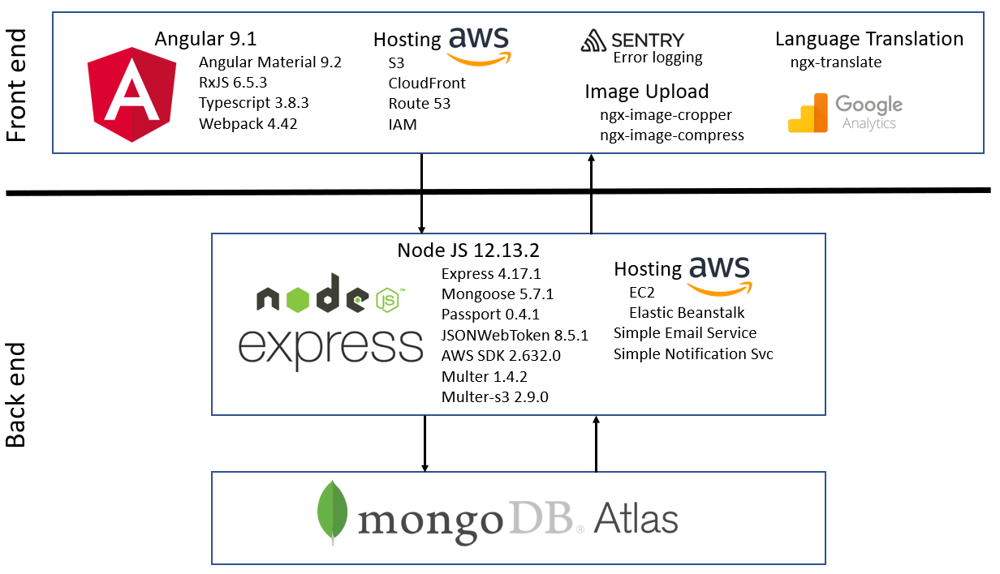
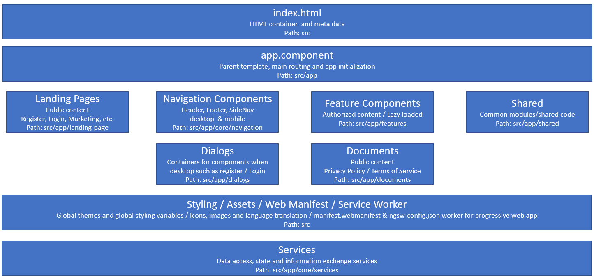
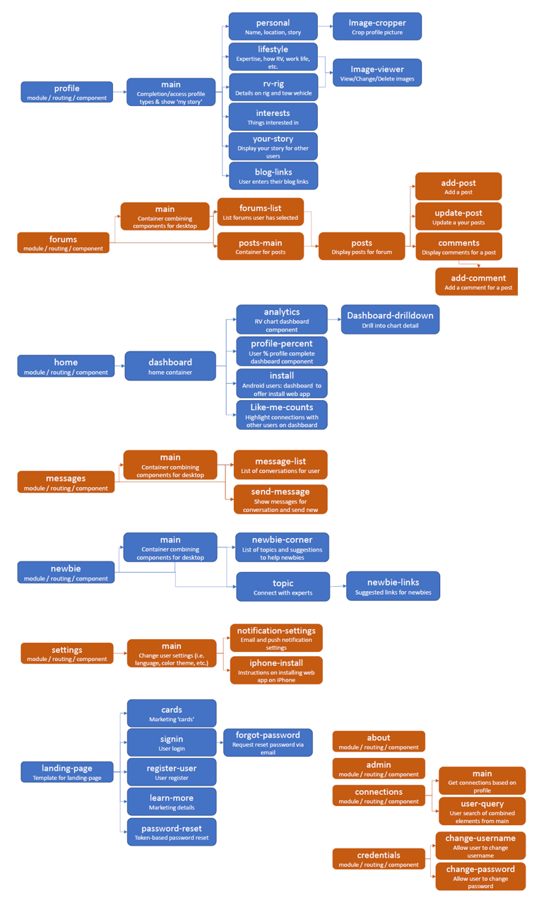

# RV Like Me Front End

This project together with [backend](https://dstaud/RVLikeMeBackEnd) are made public so you can see my work. The two projects combined are the source code for RVLikeMe.com, a progressive web app that assists RVers in finding other RVers that do the RV lifestyle like they do and communicate through forums and messaging. "Newbie" RVers have a special section to help them with typical questions and connect them with experienced RVers. Users can view the stories of other users to create a connection and encourage socialization.

## RV Like Me Architecture

## Front End Architecture

## Front End Component Map

Break-out of feature and landing page components to show how they work together and to help with understanding the source code.

## Angular CLI

This project was generated with [Angular CLI](https://github.com/angular/angular-cli) version 8.2.1.

## Development server

1: Clone the repository and run `npm install`

2: Run `ng serve` for a dev server. Navigate to `http://localhost:4200/`. The app will automatically reload if you change any of the source files.

3: Requires node.js backend running on `localhost:3000`.  See https://github.com/dstaud/RVLikeMeBackend.

## Code scaffolding

Run `ng generate component component-name` to generate a new component. You can also use `ng generate directive|pipe|service|class|guard|interface|enum|module`.

## Build

Run `ng build` to build the project. The build artifacts will be stored in the `dist/` directory. Use the `--prod` flag for a production build.

## Running unit tests

Run `ng test` to execute the unit tests via [Karma](https://karma-runner.github.io).

## Running end-to-end tests

Run `ng e2e` to execute the end-to-end tests via [Protractor](http://www.protractortest.org/).

## Further help

To get more help on the Angular CLI use `ng help` or go check out the [Angular CLI README](https://github.com/angular/angular-cli/blob/master/README.md).

End of file
